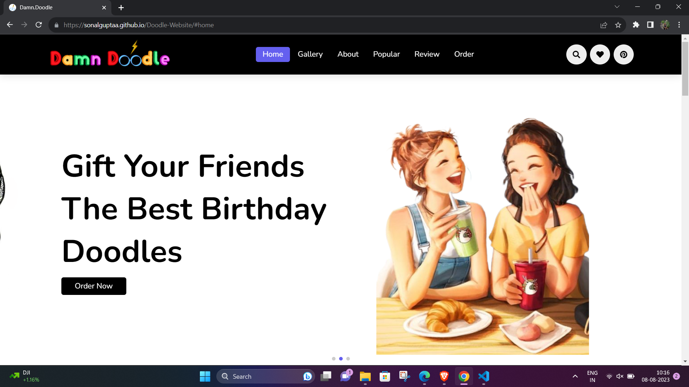
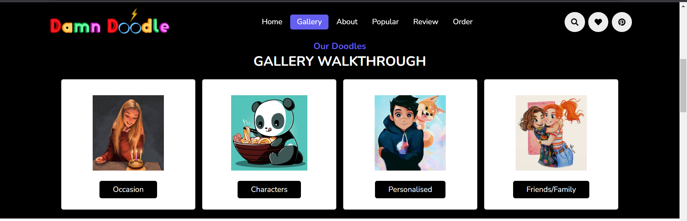
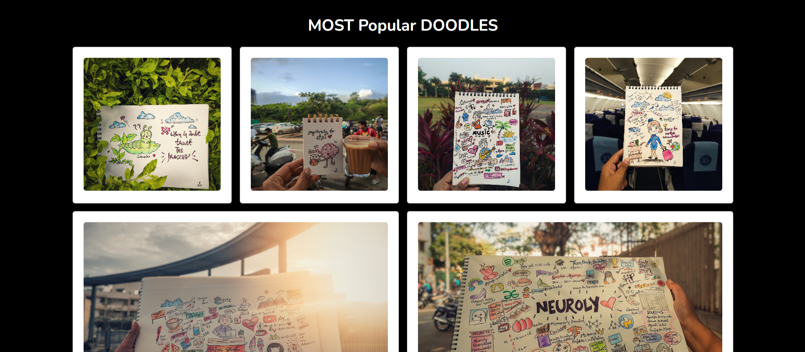
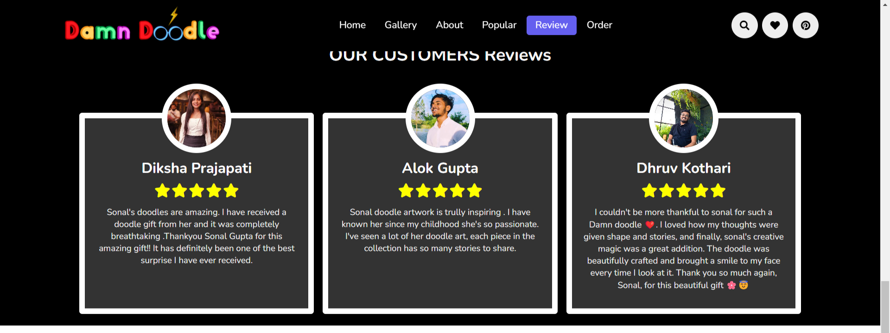
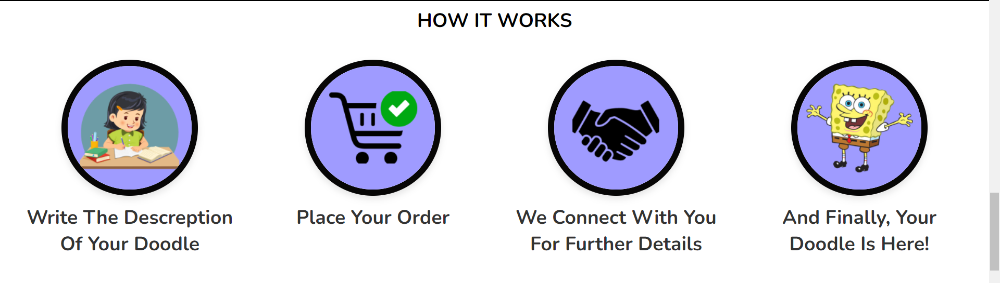
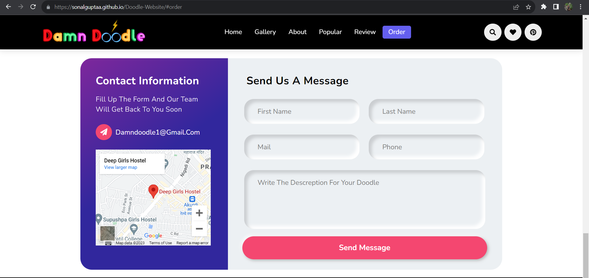

<h1 align="center">
             Damn Doodle✍️🌈
</h1>

 Developed a Website where customer can order customised Doodle for them. 

# Tech Stack Used:

 
  

## Structure Of The Project

- Damn Doodle is a creative platform that brings you a delightful collection of imaginative doodles.
-Home Page: Get started by diving into the world of Damn Doodle, where creativity knows no bounds.

-Gallery: Immerse yourself in a diverse range of doodles, each telling its own unique story and sparking your imagination.

-Most Popular Doodles: Discover the doodles that have captured the hearts of our community and gained the most recognition.

-Customer Reviews: Read genuine feedback from our satisfied customers and join the conversation by sharing your own experiences.

-Contact Us: Have questions, suggestions, or want to collaborate? Our simple contact guide will help you reach out to us effortlessly.

## Glimpse🚀

### 1. Home Page

### 2. Gallery

### 3. Popular Doodles

### 4. Customer Reviews

### 4. How it Works

### 4. Contact Page

